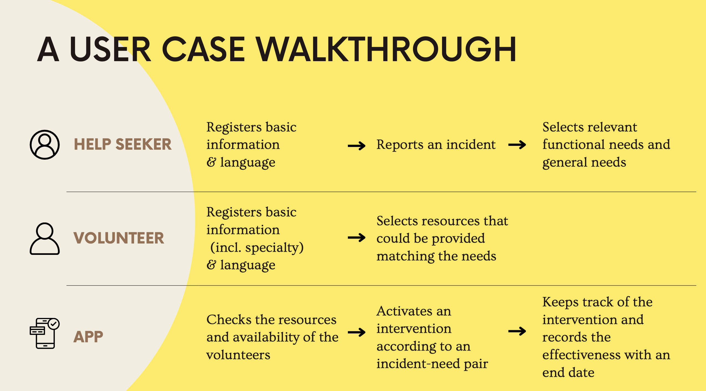
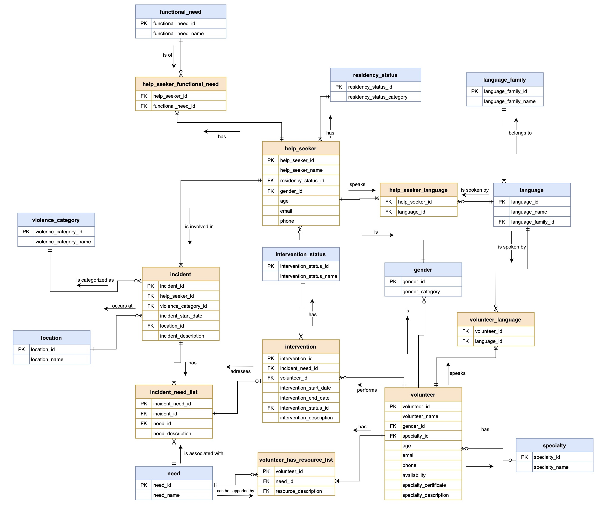
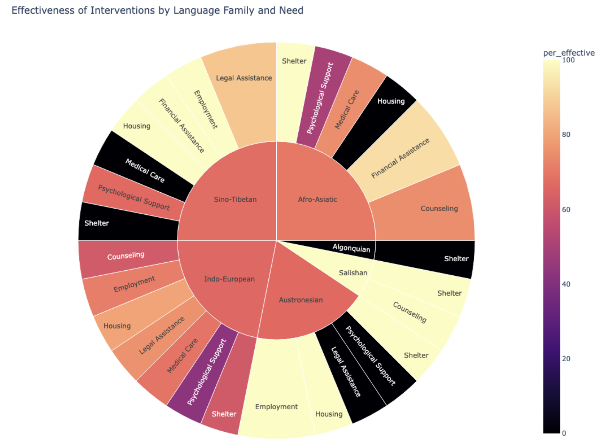
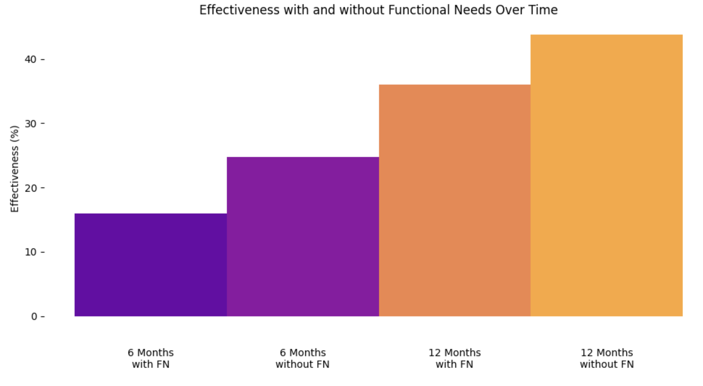
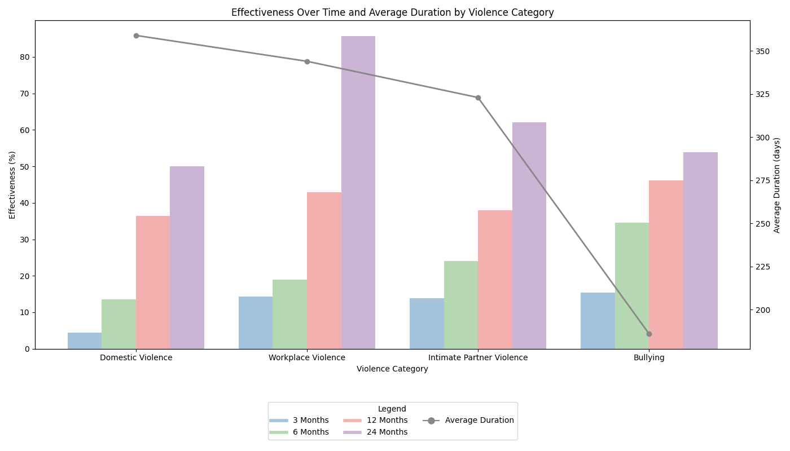
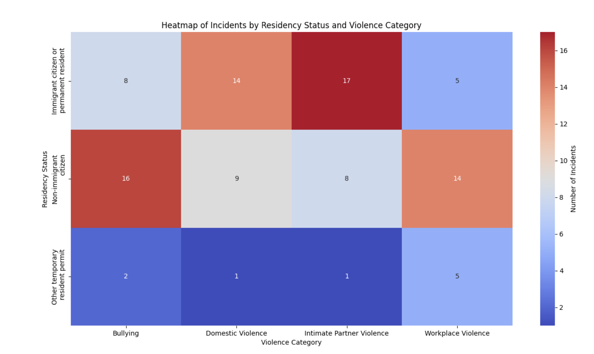

# Anti-Violence Connect 🤝

## Overview 🎯

Anti-Violence Connect is a **database backend platform** designed to **bridge the gap between help-seekers** facing **various forms of violence (e.g., domestic violence, intimate partner violence, workplace violence)** and volunteers offering critical support. This project aims to provide a streamlined system for **managing incidents, needs, and interventions** to ensure **effective matches** between help-seekers and volunteers.

## Motivation 💡

This application was inspired by real-world volunteer work assisting individuals in emergency situations in Shanghai and New York, especially marginalized communities. The goal is to **address gaps in support** that cannot be fulfilled solely by government or institutional services, offering a **community-centered approach**.

### ER Diagram 📊

The ER diagram above visualizes the relationships between entities. It includes:

- 10 basic tables (e.g., Help Seekers, Incidents, Resources).
- 9 join tables to manage many-to-many relationships (e.g., Resources and Needs).

## Database Design 🗄️

The database consists of 19 entities to track. Here are the key entities:

1. **Help-seekers**: Individuals seeking assistance
2. **Volunteers**: Individuals providing resources and support
3. **Incidents**: Records of reported violence cases
4. **Resources**: Available support services and materials
5. **Interventions**: Actions taken to assist help-seekers
6. **Languages**: Supported communication languages
7. **Skills**: Specialized abilities of volunteers
8. **Locations**: Geographic areas of operation

    📑 View More Entities (11 more)

9. **Violence_Types**: Categories of violence reported
10. **Need_Types**: Types of assistance required
11. **Contact_Methods**: Ways to reach help-seekers/volunteers
12. **Availability**: Volunteer scheduling information
13. **Emergency_Contacts**: Backup contact information
14. **Service_Areas**: Regions where support is available
15. **Resource_Categories**: Classification of available resources
16. **Qualifications**: Volunteer certifications and training
17. **Status_Updates**: Progress tracking for interventions
18. **Feedback**: Post-intervention evaluations
19. **Documentation**: Required paperwork and records

## Stored Procedures ⚙️

Two key stored procedures automate operations:

- 🤝 **Match Volunteers**:
  - Automatically match volunteers with help-seekers based on available resources and needs.

- 🔍 **Filter Interventions**:
  - Remove invalid interventions to ensure accuracy and effectiveness.

## Data Analysis Visualization 📈

Through **analysis** of the **mock data** generated for the platform, we **simulate real-world scenarios** and **reference literature** on violence and support services, revealing several key insights:

    

        
        
        
        
        
    

    
        ← Scroll horizontally to view all visualizations →
    

## Project Structure 📁

| File Name                  | Description                                                |
|----------------------------|------------------------------------------------------------|
| `query.sql`                | SQL queries for analyzing intervention effectiveness.      |
| `stored_procedures.sql`    | Scripts for volunteer matching and intervention filtering. |
| `initial_db_setup.sql`     | Initial database setup with schema and data.              |
| `er_diagram.pdf`           | Visual representation of the database schema.             |
| `incident_need_list_output.xlsx` | Sample output data for tracking incident needs.       |

## Getting Started 🚀

### Database Setup

1. Import the `initial_db_setup.sql` file to initialize the database schema.
2. Run the scripts in `stored_procedures.sql` to set up automated functions.
3. Use the queries in `query.sql` to perform data analysis and gain insights.